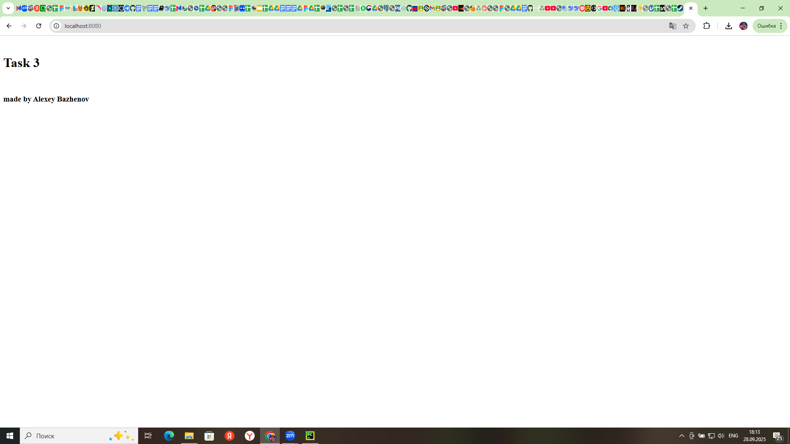

## Цель

Реализовать серверную часть приложения, которая обрабатывает HTTP-запросы.  
Клиент подключается к серверу и получает в ответ **HTTP-сообщение**, содержащее HTML-страницу, загруженную сервером из файла `index.html`.

## Выполнение

В этой задаче нужно было построить простейший веб-сервер на основе сокетов.  
Я использовал протокол **TCP**, так как именно он применяется в HTTP. На стороне сервера я создал сокет через метод `socket()`, затем привязал его к адресу и порту (`bind()`) и перевёл в режим ожидания входящих соединений (`listen()`).

Когда клиент подключается (`accept()`), сервер получает HTTP-запрос и открывает файл `index.html`, находящийся в той же папке, что и сам скрипт. Содержимое файла читается и формируется в ответ: заголовки `HTTP/1.1 200 OK`, `Content-Type`, `Content-Length`, а затем идёт сам HTML-код. Этот ответ сервер отправляет клиенту методом `sendall()`.

Так как в задаче было указание сделать именно серверную часть, в качестве клиента я использовал браузер. Если написать `127.0.0.1:8080` (адрес сервера), то он как раз отправит GET запрос на него и отобразит html файл

Таким образом, удалось реализовать минимальный аналог веб-сервера, который умеет отдавать HTML-страницу.

### Сервер

```python
import socket

server_socket = socket.socket(socket.AF_INET, socket.SOCK_STREAM)

server_socket.bind(('localhost', 8080))

server_socket.listen(1)
print("Сервер запущен на порту 8080...")

while True:
    client_connection, client_address = server_socket.accept()
    print(f'Подключение от {client_address}')

    with open("index.html", "r") as f:
        html_content = f.read()

        response = (
            "HTTP/1.1 200 OK\r\n"
            "Content-Type: text/html; charset=utf-8\r\n"
            f"Content-Length: {len(html_content)}\r\n"
            "\r\n"
            f"{html_content}"
        )

        client_connection.sendall(response.encode())

    client_connection.close()
    print("соединение закрыто")
```

## Результат

Приведен скриншот страницы, которую отдает сервер браузеру по адресу `127.0.0.1:8080`:



Сервер просто информирует о подключениях в консоли:


## Вывод

В результате удалось создать минимальный HTTP-сервер на TCP сокетах, который корректно отдаёт HTML-страницу по запросу клиента.
Это демонстрирует базовые принципы работы веб-серверов и взаимодействия по протоколу HTTP.